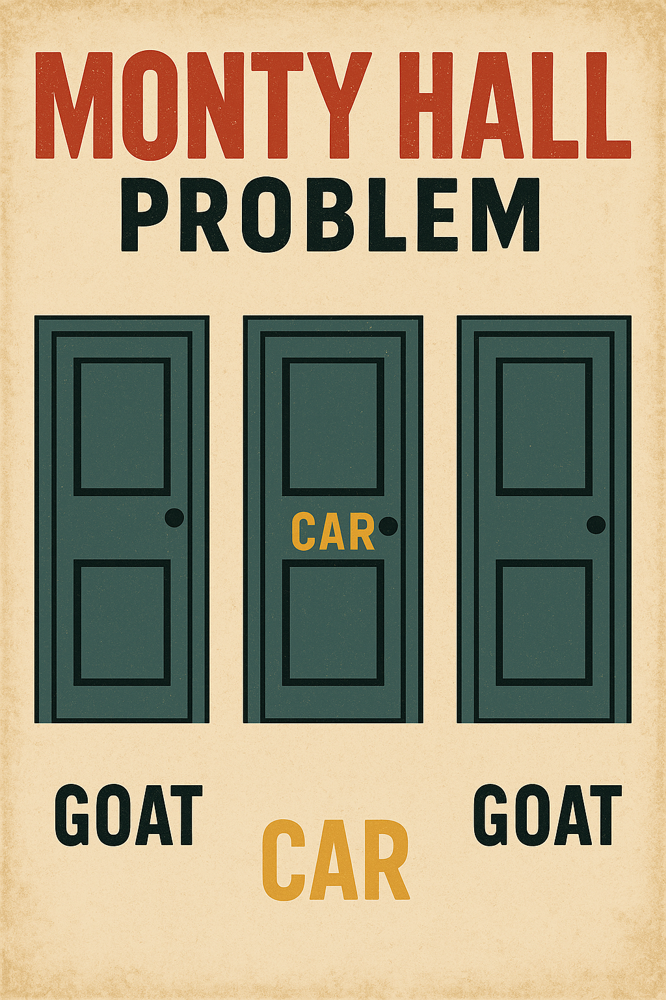
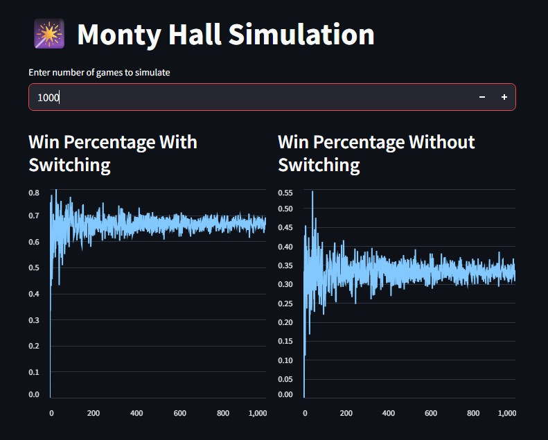

# 🎲 Monty Hall Simulation (Streamlit Edition)

A fun, interactive, and visual simulation of the classic **Monty Hall Problem** using Python and [Streamlit](https://streamlit.io/). This project demonstrates the powerful counterintuitive result of switching choices in a game show scenario, backed by statistical simulation.

<div align="center">
  
</div>


---

## 📌 What is the Monty Hall Problem?

> You are on a game show and asked to choose one of three doors. Behind one door is a **car**, and behind the others are **goats**. After you pick, the host (who knows what's behind the doors) opens one of the other two doors to reveal a **goat**, then asks: "Do you want to switch your choice to the other unopened door?"

Mathematically, **switching increases your chances of winning from 1/3 to 2/3**. This simulation demonstrates why.

---

## 🧠 Features

- 🎮 Simulate any number of Monty Hall games (1–100,000)
- 📈 Real-time line charts to show win percentages with/without switching
- 🐐 Pythonic core logic separated in a clean module
- 🚀 Built with Streamlit for a lightweight web UI

---

## 📁 Project Structure

```
06 Monty Hall Problem Simulation/
├── src/
│   └── monty_hall.py      # Core simulation logic
|   └── app.py             # Streamlit app
├── images
├── requirements.txt
└── README.md              # This file
```

---

## 🚀 How to Run

### 1. Clone the Repo

### 2. Install Dependencies
```bash
pip install streamlit
```

### 3. Run the App
```bash
streamlit run app.py
```

---

## 🔍 Sample Output

- ✅ Switching win rate: ~66%
- ❌ Staying win rate: ~33%
- 📈 Line charts stabilize as number of simulations increases

<div align="center">
  
</div>


## 📦 Requirements
- Python 3.7+
- streamlit

---

## 📌 License
MIT License.

---

## 🤝 Contributing
Pull requests are welcome! If you’d like to add more game strategies or animations, feel free to fork and improve.

---

## 🙌 Acknowledgements
- Inspired by Marilyn vos Savant’s famous column
- Poster generated using AI with DALL·E

---

> “Always switch. Unless you're just in it for the goat.” 🐐
